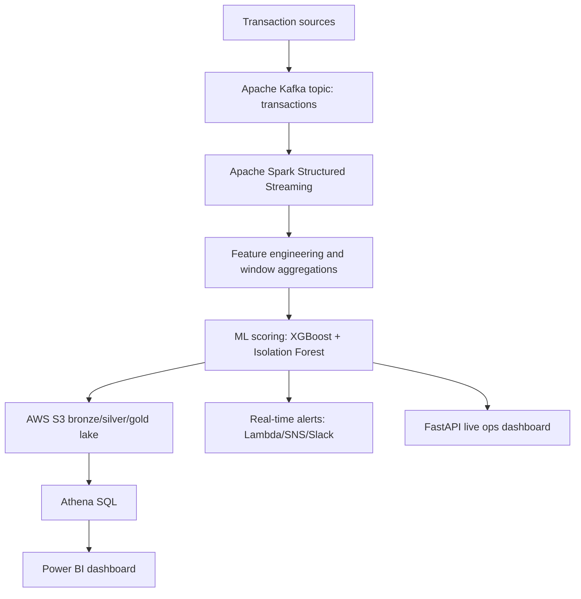

# Real-Time Fraud Detection System

Production-style fraud detection platform for payment transactions. The project mirrors a bank or fintech fraud stack: Kafka ingestion, Spark micro-batch processing, ML scoring, medallion lake storage, Athena analytics, alert routing, and a live risk-operations dashboard.

## What It Builds

- Live transaction stream with card, merchant, device, geography, and channel signals.
- Stateful feature engineering for velocity, merchant diversity, device changes, night activity, country mismatch, and geo-impossible travel.
- ML scoring with XGBoost classification plus Isolation Forest anomaly detection.
- Bronze, silver, and gold lake outputs as Parquet-ready datasets.
- Athena SQL for analyst KPIs, alert triage, and heatmap reporting.
- FastAPI dashboard for real-time transaction review and model metrics.
- Lambda-style alert handler for high-risk events.

## Architecture



## Quick Start

Create a virtual environment and install dependencies:

```powershell
python -m venv .venv
.\.venv\Scripts\Activate.ps1
pip install -r requirements.txt
pip install -e .
```

Train the scoring model:

```powershell
python -m fraud_detection.train_model --rows 50000 --fraud-rate 0.03
```

Run the local dashboard:

```powershell
uvicorn fraud_detection.dashboard_api:app --reload
```

Open:

```text
http://127.0.0.1:8000
```

Run the Kafka/Spark stack locally:

```powershell
docker compose up -d redpanda redpanda-console
python -m fraud_detection.producer --rate 20
spark-submit src/fraud_detection/spark_streaming_job.py
```

## Repository Layout

```text
src/fraud_detection/
  alerting.py             Alert classification and JSONL alert sink
  config.py               Runtime settings and project paths
  dashboard_api.py        FastAPI app powering the live dashboard
  features.py             Stateful transaction feature engineering
  model.py                XGBoost + Isolation Forest scoring wrapper
  producer.py             Kafka-compatible synthetic transaction producer
  spark_streaming_job.py  Spark Structured Streaming micro-batch job
  synthetic_data.py       Realistic card transaction simulator
  train_model.py          Offline model training entry point

frontend/
  index.html              Live fraud ops dashboard

athena/
  fraud_kpis.sql          Executive and model KPI queries
  fraud_heatmap.sql       Hour/day fraud pattern query
  alert_triage.sql        Analyst alert queue query

lambda/
  fraud_alert_handler.py  AWS Lambda event handler for high-risk alerts
```

## Interview Talking Points

- Spark is used for stateful stream processing, not just speed. It turns isolated payments into behavioral signals.
- Kafka decouples transaction ingestion from scoring so producers and consumers scale independently.
- The model combines supervised classification with anomaly detection, which is useful when fraud labels are sparse or delayed.
- S3 medallion storage keeps raw events, engineered features, and analyst-ready scored records separate.
- Athena and Power BI make the scored stream usable by risk teams without requiring them to operate the ML pipeline.

## Validation

Run the lightweight tests:

```powershell
python -m pytest
```

Compile the package without external services:

```powershell
python -m compileall src
```
